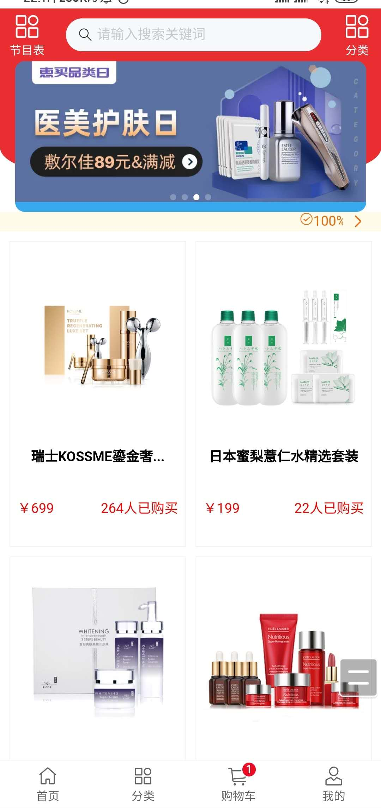
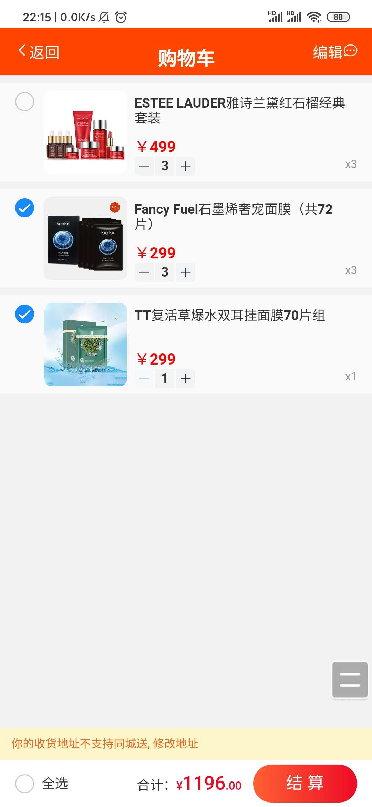
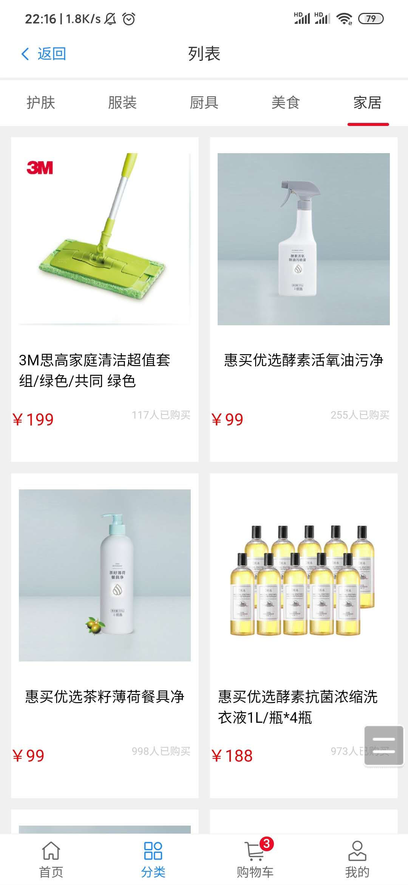
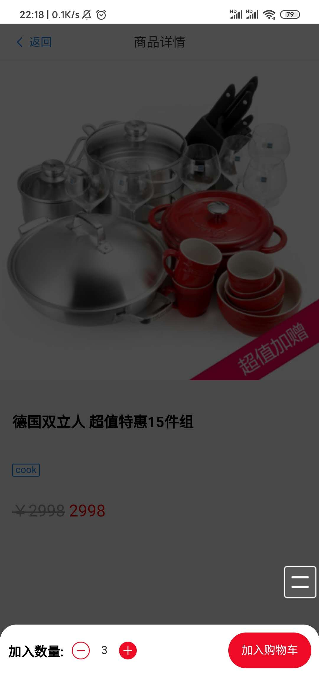
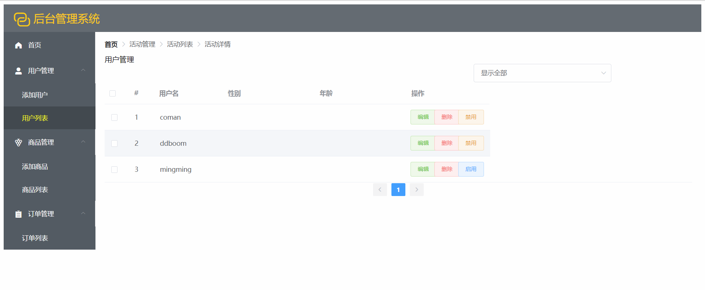
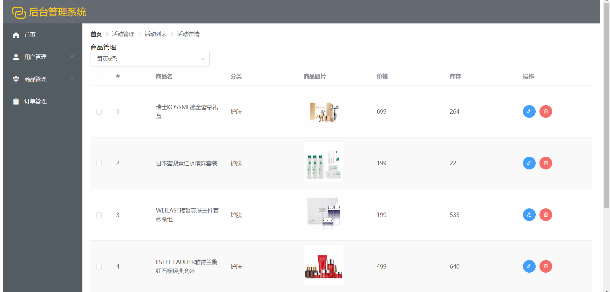
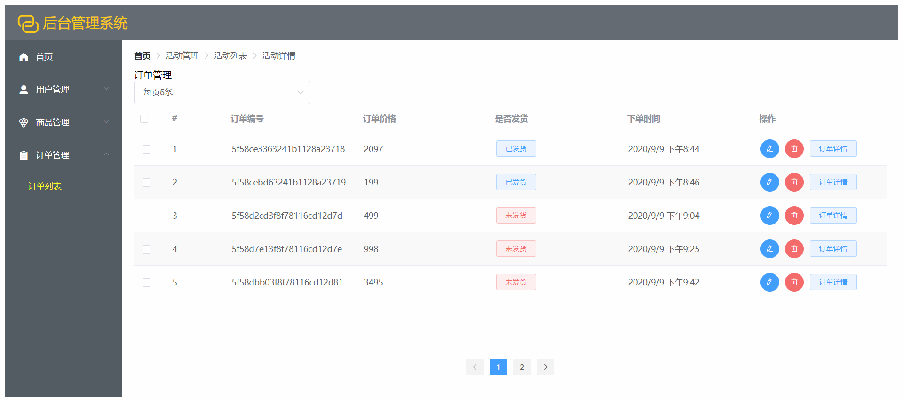
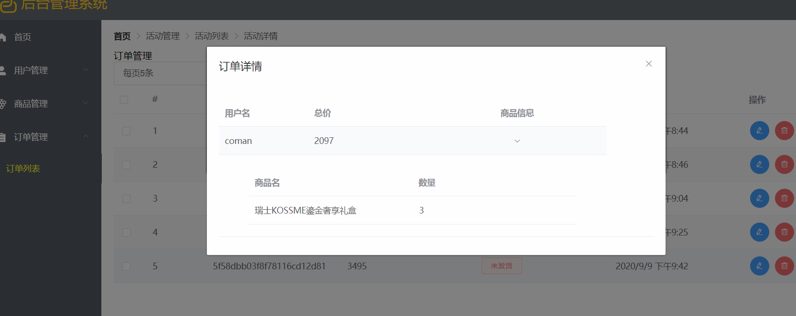

## 项目名称：ugoshop

## 演示

    - 官网：https://m.ugoshop.com/
    - 上线地址：http://coman.icu:8081
    -  后台管理系统赋值 : http://coman.icu:8080

## git仓库地址

## 团队和分工
    
    - 组长：余克棉
    - 组员：黄嘉明，张慧，刘昊
    - 负责模块：
        + 余克棉：后台管理的商品管理和订单管理模块，客户端的列表模块，重构大部分后端接口，短信验证码接口，商品接口，订单接口.
        + 黄嘉明：客户端登录注册功能（包含手机验证码），后台用户管理功能（可以设置用户登录权限），
        + 张慧：后台管理系统的登录、注册功能（重构后已废除），客户端的购物车模块
        + 刘昊：客户端首页模块，客户端详情页模块，客户端购物车的前后端交互，客户端订单功能的前后端交互，协作组长完成购物车的接口
    - 项目页面截图

    

    

    

    

    

    

    

    
    
    - 项目目录说明
    ```
    //apiserver目录结构(后端)

        ├─router
        │  ├─blog （文章接口）
        │  ├─comment （评论接口）
        │  ├─filter（cors）
        │  ├─goods （商品接口）
        │  ├─huihui （登录注册接口）
        │  ├─order （订单接口）
        │  ├─trolley （购物车接口）
        │  ├─userlist （用户管理接口）
        │  └─utils （mongo，token等工具）
        └─spider （爬取的数据）
            └─data 
    ```

    ```
    //根目录结构（后台管理系统）

        ├─public 静态资源
        └─src
            ├─assets 静态资源
            ├─pages 页面各个组件
            │  ├─blogs （已废弃）
            │  ├─goods  商品组件
            │  ├─loginReg   （已废弃）
            │  ├─order  订单组件
            │  └─user   用户组件
            ├─router    路由
            ├─store     vuex的js文件
            ├─userdata  （没用的）
            └─utils       各种封装的函数
    ```

    ```
    //mobileapp（客户端）

    ├─public 
    │  └─img
    └─src
        ├─assets 静态资源
        │  └─img
        ├─components 功能组件
        ├─router 路由
        ├─store vuex的js文件
        ├─utils 请求的封装
        └─views 各个页面组件
    ```